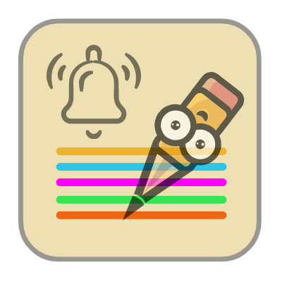

#  Scrinota
**Current Version: 1.0.0.** *The current version in this repo is a prototype version for the final project of the course CS50: Introduction to Computer Science. More about the course in the acknowledgement.*

<!-- TABLE OF CONTENTS -->
<details open="open">
  <summary>Table of Contents</summary>
  <ol>
    <li>
      <a href="#project-description">Project Description</a>
      <ul>
        <li><a href="#concept">Concept</a></li>
        <li><a href="#reason-for-this-project">Reason for this Project</a></li>
        <li><a href="#tools-and-apis-used">Tools and APIs used</a></li>
      </ul>
    </li>
    <li>
      <a href="#getting-started">Getting Started</a>
      <ul>
        <li><a href="#prerequisites">Prerequisites</a></li>
        <li><a href="#installation">Installation</a></li>
      </ul>
    </li>
    <li><a href="#usage">Usage</a></li>
    <li><a href="#roadmap">Roadmap</a></li>
    <li><a href="#contributing">Contributing</a></li>
    <li><a href="#license">License</a></li>
    <li><a href="#contact">Contact</a></li>
    <li>
      <a href="#acknowledgements">Acknowledgements</a>
    </li>
  </ol>
</details>

<!-- Project Description -->
## Project Description

### Concept

**Scrinota** is a chrome extension that lets you the user set up reminders to open a webpage at a specific time in the future and as well with a feature to add notes for any given website that you the user can access anytime along with the webpage.

Design features to implement/implemented:
* Reminder to open webpage at any time in future, reducing the current active tabs.
* Take notes on webpage and view notes specific to a current webpage with option to view all the notes.
* Option to set reminder for notes along with webpage.
* To implement a cross platform application for all devices.

### Reason for this project
I noticed that I always tend to have several chrome tabs open, my intention to open all those tabs was that I might have found them useful and I wanted to visit them at a later date. All those tabs end up staying in my current browser for weeks and to be honest I still have not noticed some of them yet because just like one particular tab, I have couple more tabs open.

Doing this has cost me my PC’s memory and an overwhelming number of tabs being open. After talking to some people about the idea, I realized that other people who do the same thing. Hence, an idea sparked in my mind where I thought what if I create a chrome extension that acts as a reminder for accessing webpage. Along with the reminder feature, I thought adding notes taking feature specific to links would also be an added benefit for organizing notes. This way I do not have to keep the webpage as one of my current open tabs and I can free up some of my memory for other uses.

### Tools and APIs used
1. Web developement tools - HTML, CSS (Framework-<a href="https://getbootstrap.com/">Bootstrap</a>), Javascript.
2. APIs used - <a href="https://developer.chrome.com/docs/extensions/reference/storage/">Chrome.Storage</a>, <a href="https://developer.chrome.com/docs/extensions/reference/windows/">Chrome.windows</a>, <a href="https://developer.chrome.com/docs/extensions/reference/notifications/">Chrome.notifications</a>, <a href="https://developer.chrome.com/docs/extensions/reference/alarms/">Chrome.alarms</a>.

<!-- Getting Started -->
## Getting Started

### Prerequisites

This extension was built for the chrome browser platform, I would recommend to get familiar with using the chrome browser before playing around with the extension.

Follow this <a href="https://www.google.com/chrome/thank-you.html?statcb=1&installdataindex=empty&defaultbrowser=0">link</a> to download chrome browser.

### Installation

1. Clone the repo
   ```sh
   git clone https://github.com/your_username_/Project-Name.git
   ```
 
2. Open the chrome browser and type ***chrome://extensions*** into the address bar.
3. In the extension page, toggle the developer mode button and you will see the options below, of that click the load unpacked button and select the project folder.
  
  
4. Now I assuming you have uploaded the chrome extension into the browser, you should see the **Scrinota** icon next to the address bar. If you do not see the icon. then click the extension icon highlighted below in the screenshot and the popup will appear then pin scrinota to address bar.

<p align="center"></p>

5. That's it! Now enjoy using the extension and do let me know if you have any feedback.

<!-- Usage -->
## Usage

The badge you see in the extension icon shows the number of active reminders.

### Popup Page

<p align="center"></p>

On this page, you will be able to see active reminder that you have set. The plus button below will take you to **reminder page**. This page also has link which will take you to **completed page**. In this page, you will also be able to delete an active reminders that you have set previously.

### Completed Page

<p align="center"></p>

On this page, you will be able to see all the completed reminders in a table.

### Reminder Page

<p align="center"></p>

On this page, you will be able to add a new reminder in a form. The form contains input space for date, time, URL, and URL title. Upon submission, the extension will take you to popup page.

<p align="center"></p>

The logo icon will take you to the active reminders page i.e., popup page and the help icon will take you to a page filled with the extension uses and how to use the extension. 

<!-- Roadmap -->
## Roadmap

* This prototype version will only include a reminder option, where a user can set up a date and time for any particular website they wish to visit in the future.
* Next in pipeline would be to implement the note taking feature and to make it unique to websites.

<!-- Contributing -->
## Contributing

Contributions are what make the open source community such an amazing place to be learn, inspire, and create. Any contributions you make are **greatly appreciated**.

1. Fork the Project
2. Create your Feature Branch (`git checkout -b feature/AmazingFeature`)
3. Commit your Changes (`git commit -m 'Add some AmazingFeature'`)
4. Push to the Branch (`git push origin feature/AmazingFeature`)
5. Open a Pull Request

<!-- LICENSE -->
## License

Distributed under the MIT License. See `LICENSE` for more information.

<!-- Contact -->
## Contact

LinkedIn - [https://www.linkedin.com/in/ahmed-arafaath-ali-952a24117/](https://www.linkedin.com/in/ahmed-arafaath-ali-952a24117/)


<!-- ACKNOWLEDGEMENTS -->
## Acknowledgements
This extension was developed as a final project for the course CS50. Go to this [link](https://cs50.harvard.edu/x/2021/) for more details on the course.
This course teaches students how to think algorithmically and solve problems efficiently. Topics include abstraction, algorithms, data structures, encapsulation, resource management, security, software engineering, and web programming. Languages include C, Python, and SQL plus HTML, CSS, and JavaScript. 

Thanks Prof. David Malan, Brian Yu, Doug Lloyd for introducing me to the world of computer science. Through working on this project I had the most fun in solving the challenges and thinking about implementation in lower level. With the help of this course, I was able to bring my abstract idea into logical reality.

